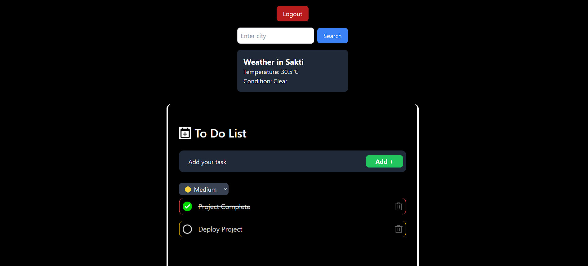
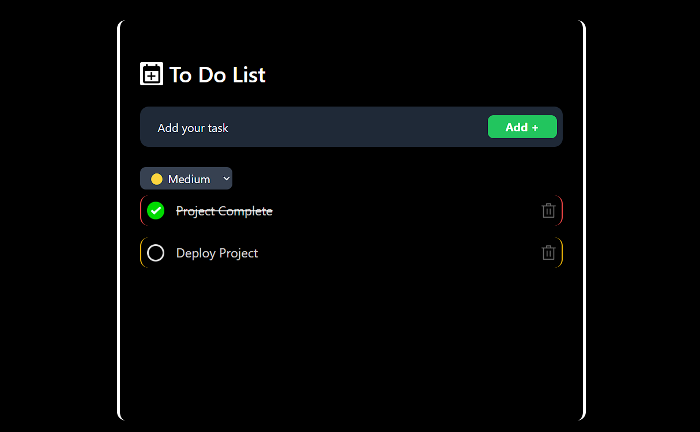
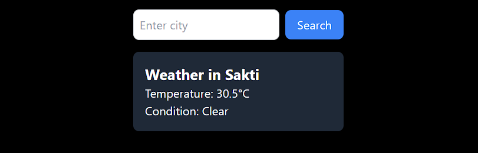

# Advanced To-Do App with Weather Integration

---

## 🌐 Live Demo
Check out the live demo of the app here:  
[**Advanced To-Do App**](https://note-todo-list.netlify.app/)

---

## 📋 Project Overview
This is an advanced **To-Do App** built with React and Redux, featuring:
- **Task Management**: Add, delete, and mark tasks as complete/incomplete.
- **Priority-Based Sorting**: Assign priorities (High, Medium, Low) to tasks and visually differentiate them.
- **Weather Integration**: Fetch and display real-time weather data for any city.
- **User Authentication**: Login/logout functionality to protect the To-Do list.
- **Persistent Storage**: Tasks and user authentication state are saved to `localStorage` for persistence across page reloads.

---

## 🚀 Features
### **1. Core To-Do Functionality**
- Add tasks via input and button click or by pressing `Enter`.
- Delete tasks with a single click.
- Mark tasks as complete/incomplete.
- Assign priorities (High, Medium, Low) to tasks.
- Tasks are visually differentiated by priority using colored borders.

### **2. Weather Integration**
- Fetch and display real-time weather data for any city.
- Users can manually input a city name to get weather details.
- Weather details include:
  - Temperature (in Celsius).
  - Weather condition (e.g., Sunny, Cloudy).

### **3. User Authentication**
- Simulated login/logout functionality using Redux.
- Protects the To-Do list so only logged-in users can access it.

### **4. Persistent Storage**
- Tasks and user authentication state are saved to `localStorage`.
- Data persists across page reloads.

### **5. Responsive Design**
- The app is fully responsive for devices with a minimum width of 300px. Smaller devices may require additional adjustments for optimal usability.

---

## 🛠️ Technologies Used
- **Frontend**: React, Redux, Redux Thunk
- **Styling**: Tailwind CSS
- **API Integration**: WeatherAPI (for fetching weather data)
- **State Management**: Redux Toolkit
- **Persistence**: `localStorage`

---

## 📝 How to Use the App

### **1. Login**
- Open the app in your browser.
- Enter your login credentials (if required) and click the "Login" button to access the To-Do list.

### **2. Add a Task**
- Enter a task in the input field at the top of the To-Do list.
- Press the "Add +" button or hit the `Enter` key to add the task to the list.

### **3. Mark a Task as Complete**
- Click on a task to toggle its completion status.
- Completed tasks will be visually updated (e.g., strikethrough text).

### **4. Delete a Task**
- Click the delete icon next to a task to remove it from the list.

### **5. Assign Priority**
- Use the dropdown menu next to the input field to assign a priority (High, Medium, Low) to a task before adding it.
- Tasks are visually differentiated by priority using colored borders.

### **6. Search for Weather**
- Enter a city name in the weather search input field.
- Click the "Search" button to fetch and display the current weather for the entered city.
- Weather details include:
  - Temperature (in Celsius).
  - Weather condition (e.g., Sunny, Cloudy).
  - Weather icon for better visualization.

### **7. Logout**
- Click the "Logout" button in the top-right corner to log out of the app.
- The To-Do list will no longer be accessible until you log in again.

---

## 📸 Screenshots
### **1. Login Screen**


### **2. To-Do List with Weather Integration**


### **3. Adding a Task**


### **4. Weather Search**


---

## ⚙️ Setup Instructions
Follow these steps to set up and run the project locally:

```bash
### **1. Clone the Repository**
git clone https://github.com/anuraguranw3/project-to-do-list.git
cd project-to-do-list

---

### **2. Install Dependencies**
Run the following command to install all the required dependencies:
```bash
npm install

---

### **3. Add Your WeatherAPI Key**
- Go to [WeatherAPI](https://www.weatherapi.com/) and sign up for a free account.
- Get your API key and replace the placeholder in `src/features/weather/weatherAPI.js`:
  ```javascript
  const KEY = "your_weatherapi_key"; // Replace with your actual API key

---

  ### **4. Start the Development Server**
Run the following command to start the development server:
```bash
npm run dev

---

### **5. Open the App**
- Open your browser and navigate to the following URL:
http://localhost:5173/